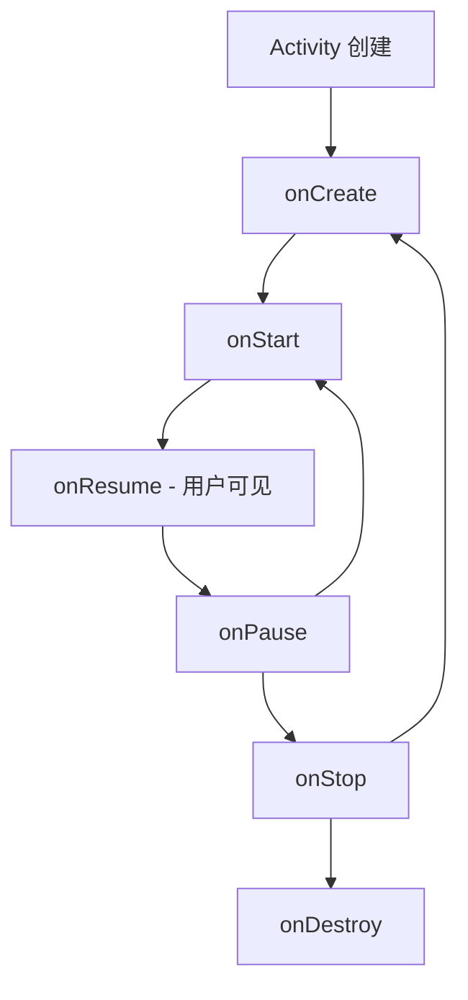
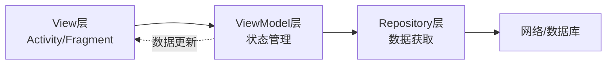

# 课程内容编写指南

> 面向 AI 辅助开发时代的 Android 学习课程内容标准

---

## 一、目标学员画像

### 基础背景
- 有 JavaScript/TypeScript 前端开发经验
- 零 Android 开发基础
- 习惯使用 AI 辅助编程（Cursor、Claude 等）

### 学习目标
- **核心能力**：能理解和评估 AI 生成的 Android 代码
- **实战能力**：能通过 AI 协作完成功能开发
- **问题排查**：能根据 Logcat 日志定位和修复问题

### 不需要的能力
- 手写复杂的底层代码
- 记忆所有 API 细节
- 处理边缘场景和极端优化

---

## 二、内容设计原则

### 1. 知识分级：必须掌握 vs 了解即可

#### P0 级（必须掌握）
- AI 生成代码中出现频率 > 80% 的知识点
- 与应用稳定性直接相关（如空安全的 `!!`）
- Android 特有的核心概念（如 Activity 生命周期、ViewBinding）

**判断标准**：
- 不掌握会导致无法看懂 AI 代码
- 不掌握会导致应用崩溃
- 后续所有课程都会用到

#### P1 级（了解即可）
- AI 会自动处理的细节
- 遇到时能查文档即可
- 高级用法和优化技巧

**判断标准**：
- AI 能正确生成，人工评估时能看懂含义就够
- 使用频率 < 30%
- 不影响核心功能实现

#### P2 级（暂不学习）
- 边缘场景和极端优化
- 过时的 API 和模式
- 框架源码和底层实现

**示例对比**：

| 知识点 | 级别 | 理由 |
|-------|------|------|
| `?.` 安全调用 | P0 | AI 代码中到处都是 |
| `lateinit` | P0 | Activity/Fragment 必用 |
| `!!` 的危险性 | P0 | AI 容易滥用，需要人工识别 |
| `as?` 安全转换 | P1 | 使用频率低，AI 会处理 |
| `::binding.isInitialized` | P1 | 极少用到的检查方法 |
| 自定义协程调度器 | P2 | 高级主题，暂不需要 |

**边界案例讨论**：

| 知识点 | 争议点 | 建议级别 | 理由 |
|-------|--------|---------|------|
| Jetpack Compose | 是否必学？ | P0 | 现代Android开发趋势，AI生成率高 |
| XML布局 | 是否还需要？ | P1 | 遗留项目可能用到，但非核心 |
| LiveData vs Flow | 哪个优先？ | Flow: P0, LiveData: P1 | Flow是新标准，AI优先生成 |
| Hilt vs Koin | 哪个学？ | Hilt: P0, Koin: P1 | Google官方推荐 |
| Coroutines异常处理 | 多深？ | try-catch: P0, Handler: P1 | 基础必须会，高级按需 |

---

### 2. 时长控制

**单节课时长建议**：
- 基础概念：10-15 分钟
- 核心特性：15-20 分钟
- 复杂主题：20-30 分钟

**避免**：
- 超过 30 分钟的课程（认知负荷过大）
- 少于 8 分钟的课程（内容过于碎片化）

**时长优化方法**：
1. 删除 P1/P2 级别的知识点
2. 减少冗余的代码示例
3. 合并相似的场景说明
4. 提供速查表代替详细解释

---

## 三、内容结构设计

### 标准结构模板

```
1. 开篇：真实场景引入（2-3 分钟）
   └─ 展示问题 → 引发思考 → 建立学习动机

2. 核心知识点（按重要性排序，8-15 分钟）
   ├─ 知识点 1（P0）：基础概念
   ├─ 知识点 2（P0）：常用操作
   ├─ 知识点 3（P0）：危险点/易错点
   └─ 知识点 4（P1）：进阶用法（可选）

3. 实战对比（3-5 分钟）
   └─ 好代码 vs 坏代码

4. 速查表 + 总结（2 分钟）
   └─ 实用工具，忘记时可快速查阅
```

---

### 具体写作技巧

#### （1）场景化开篇

**避免：** 直接讲概念
```markdown
## 什么是空安全？
Kotlin 的空安全是一种类型系统...
```

**推荐：** 用真实场景引入
```markdown
## 为什么要学空安全？

想象一下：你写了一个显示用户昵称的功能，测试时发现 App 崩溃了。

（附代码示例和崩溃日志）

问题：用户没设置昵称，`nickname` 是 null...
```

---

#### （2）利用前端经验类比

**目标**：降低学习门槛，建立知识桥梁

**示例**：
```markdown
JS 开发者注意：Kotlin 的 `?.` 就像 TS 的 Optional Chaining，
但编译器会强制你处理 null，不给你崩溃的机会。

对比表格：
| 语言       | 行为                    |
| JS         | null.length → 崩溃      |
| TypeScript | 类型检查，但不严格       |
| Kotlin     | 编译时强制处理          |
```

---

#### （3）好坏代码对比

**格式要求**：
- 用 ✅ 和 ❌ 清晰标记
- 先展示坏代码，再展示好代码
- 注释说明问题所在

**示例**：
```kotlin
// ❌ 危险写法（容易崩溃）
val user = database.getUser(userId!!)  // userId 是 null → 崩溃
textView.text = user!!.name            // user 是 null → 崩溃

// ✅ 安全写法
val user = userId?.let { database.getUser(it) } ?: return
textView.text = user.name  // 这里 user 保证非空
```

---

#### （4）渐进式难度

**原则**：从简单到复杂，每个知识点独立理解

**示例（空安全课程）**：
```
简单 → 中等 → 复杂
?    → ?.   → ?:  → !!  → lateinit
```

**避免**：一次性抛出所有概念
```markdown
// ❌ 坏的顺序
## 空安全的所有操作符
讲完 ?. ?: !! lateinit as? 所有东西...

// ✅ 好的顺序
## 基础：认识可空类型 ?
（单独讲清楚）

## 处理方式1：安全调用 ?.
（配合例子）

## 处理方式2：提供默认值 ?:
（配合例子）
...
```

---

## 四、写作风格要求

### 1. 语气与定位

**核心原则**：学习者 > 监工

**推荐语气**：
- "看到 X 就知道..."（建立识别模式）
- "常见的用法是..."（描述实际场景）
- "建议..."、"推荐..."（给出建议）
- "重点关注..."（强调要点）

**避免过度使用**：
- "审查 AI 代码"（可偶尔使用，但不要反复强调）
- "检查"、"修正"等质检口吻（改为"识别"、"优化"）
- "你必须..."、"务必..."等强制语气

**示例对比**：

| 避免 | 推荐 |
|-----|------|
| 审查重点：看到 `!!` 要警惕 | 重点：看到 `!!` 就要小心 |
| 审查武器1、审查武器2... | 基础、处理方式1、处理方式2... |
| 这是你必须修正的第一要务 | 99% 的情况下应该改成... |
| AI 常犯的错误 | 常见问题 |

---

### 2. Markdown 格式规范

#### 标题层级
```markdown
## 一级标题（知识点/章节）
不需要用 # 顶级标题（留给课程标题）

### 二级标题（子概念）
仅在必要时使用
```

#### 强调样式
```markdown
**加粗**：关键概念、重点
`代码`：操作符、类名、变量名
```

#### 列表使用
```markdown
- 无序列表：用于并列项
1. 有序列表：用于步骤、优先级

表格：用于对比、速查表
| 列1 | 列2 |
|-----|-----|
```

---

### 3. 代码示例规范

#### 代码块要求
1. **优先使用可运行代码**（避免伪代码）
2. **如必须用伪代码**：需明确标注 `// 伪代码示例`
3. **必须包含注释**：
   - 输出结果（如 `// 输出: 10`）
   - 关键逻辑说明（如 `// 这里会触发网络请求`）
4. **长度适中**：10-20 行为宜
5. **避免让学生猜结果**

**示例：**
```kotlin
val nickname: String? = getUserNickname()

// ✅ 安全写法
val length = nickname?.length  // nickname 是 null 时，返回 null

// 链式调用也安全
val firstChar = nickname?.uppercase()?.first()  // 任何一步 null 就返回 null
```

**完整示例（带输出）：**
```kotlin
val name = "张三"
val greeting = "你好，$name"
println(greeting)  // 输出: 你好，张三
```

#### 避免的代码示例
- ❌ 超过 30 行的代码（拆分成多个示例）
- ❌ 缺少输出说明（让学生猜结果）
- ❌ 语法错误或过时 API
- ❌ 未标注的伪代码

---

### 4. 提示框使用

#### 类型定义

**tip（绿色）**：补充说明、技巧、记忆方法
```markdown
`?.` 是 Kotlin 最常用的空安全操作符，代码里到处都是。
```

**warning（橙色）**：危险操作、易错点、重点警告
```markdown
重点：看到 `!!` 就要小心！

99% 的情况下应该改成：
- `user!!.name` → `user?.name ?: "默认值"`
- `userId!!` → `userId ?: return`
```

#### 使用频率
- 每节课 2-4 个 tip
- 每节课 1-2 个 warning
- 避免连续出现超过 2 个提示框

---

### 5. 多媒体元素使用

#### 流程图/架构图（推荐使用）

**适用场景**：
- ✅ 生命周期流程（Activity/Fragment）
- ✅ MVVM/MVI 架构层级关系
- ✅ 数据流向（ViewModel → View）
- ✅ 导航流程（页面跳转逻辑）
- ❌ 过于复杂的 UML 类图

**Mermaid 流程图示例**：



**MVVM 架构图示例**：



**使用建议**：
- 使用 Mermaid 语法（Markdown 原生支持）
- 保持流程图简洁，不超过 10 个节点
- 关键节点用中文标注
- 配合文字说明使用

#### 截图/图片（可选）

**适用场景**：
- ✅ Logcat 错误截图（帮助识别问题特征）
- ✅ Android Studio 界面指引（操作步骤）
- ✅ 应用运行效果对比（UI 展示）
- ❌ 纯装饰性图片（增加认知负荷）

**使用原则**：
- 截图需要清晰，关键部分高亮标注
- 图片文件命名规范：`lesson-id-description.png`
- 避免过大的图片（建议 < 500KB）

#### 视频（谨慎使用）

**适用场景**：
- 仅在必要时使用（如复杂操作演示）
- 时长控制在 2-3 分钟以内
- 提供文字版操作步骤作为备选

---

## 五、AI 协作实战指导

### 1. 课程中融入 AI 对话示例

**目标**：让学生学会如何与 AI 有效协作，而非依赖 AI

#### 展示"如何向 AI 描述需求"

**❌ 模糊描述**：
```
"写一个登录页面"
```

**✅ 具体描述**：
```
用 Jetpack Compose 写一个登录页面：
- 邮箱输入框（带格式验证）
- 密码输入框（带可见/不可见切换）
- 登录按钮（点击后显示加载动画）
- 使用 MVVM 架构，ViewModel 处理登录逻辑
```

#### 展示"如何评估 AI 生成的代码"

**评估清单**（可在课程中提及）：
1. ✅ 是否使用了正确的 API（如 Flow 而非 LiveData）
2. ✅ 空安全处理是否充分（是否滥用 `!!`）
3. ✅ 协程作用域是否正确（是否用了 viewModelScope）
4. ✅ 错误处理是否完善（try-catch）

**课程中的示例**：
```markdown
看到 AI 生成了这样的代码：

```kotlin
val user = database.getUser(userId!!)  // 问题：使用了 !!
textView.text = user.name              // 问题：没有空安全处理
```

识别出的问题：
- `!!` 可能导致崩溃
- `user.name` 可能是 null

改进后：
```kotlin
val user = userId?.let { database.getUser(it) } ?: return
textView.text = user.name ?: "未知用户"
```
```

#### 展示"如何修正 AI 的错误"

**场景化教学**：
```markdown
AI 生成的代码运行后崩溃，Logcat 显示：

```
NetworkOnMainThreadException
```

如何向 AI 描述问题：
"代码崩溃了，Logcat 显示 NetworkOnMainThreadException，
应该是网络请求在主线程执行了，帮我改用协程"
```

---

### 2. 实战场景完整流程

**标准流程**：需求 → AI对话 → 代码评估 → 测试 → 修复

**课程中的实战案例示例**：

```markdown
## 实战：用 AI 协作实现用户列表

**步骤1：描述需求**
向 AI 说明："用 Jetpack Compose 显示用户列表，
数据从 API 获取，使用 Retrofit + Flow + MVVM"

**步骤2：评估生成的代码**
检查要点：
- ✅ ViewModel 中是否用 viewModelScope
- ✅ API 调用是否在 suspend 函数中
- ✅ Flow 的 collect 是否正确

**步骤3：测试运行**
在 Android Studio 运行，观察 Logcat

**步骤4：发现问题并修复**
如果出现 "Unable to resolve host"：
检查 AndroidManifest.xml 是否添加了 INTERNET 权限
```

---

### 3. AI 协作的正确心态

**在课程开篇或总结中强调**：

**✅ 推荐心态**：
- AI 是"编码助手"，不是"答案机器"
- 我需要理解 AI 生成的每一行代码
- 遇到问题时，先看 Logcat，再问 AI

**❌ 避免心态**：
- "AI 说的一定对"
- "复制粘贴就能用"
- "不懂也没关系，能跑就行"

**课程中的提醒方式**（自然融入）：
```markdown
AI 可能会生成 `user!!.name` 这样的代码。
看到 `!!` 就要想：这里可能是 null 吗？
如果是，改成 `user?.name ?: "默认值"`。

这就是为什么要学空安全——不是为了手写代码，
而是为了识别 AI 代码中的潜在问题。
```

---

### 4. 自然融入而非刻意强调

**不要**：反复强调"审查 AI 代码"
**而是**：在真实场景中自然提及

**示例：**
```markdown
// ❌ 过度强调
## 审查武器1：安全调用 ?.
这是审查 AI 代码时最常见的...

// ✅ 自然融入
## 处理方式1：安全调用 ?.
含义：如果不是 null 就调用...
（代码示例）
`?.` 是 Kotlin 最常用的操作符，代码里到处都是。
```

---

### 5. 识别模式培养

**目标**：让学生看到特定符号能立即判断

**方法**：
- "看到 X 就知道..."
- "X 表示..."
- "出现 Y 通常意味着..."

**示例：**
```markdown
看到 `String?`、`User?`、`List<User>?` 就知道
"这个变量可能是 null，需要特殊处理"。

看到 `lateinit` 就知道：这个变量会在后面某个地方初始化
（通常是 `onCreate`），在那之后就可以安全使用了。
```

---

### 6. 实战工具提供

**每节课结尾提供**：
- 速查表（忘记时快速查阅）
- 检查清单（实战时快速扫描）
- 常见问题对比

**示例：**
```markdown
## 速查表：空安全操作符

忘记了随时回来看：

?     → 标记可空类型            String? = null
?.    → 安全调用                user?.name
?:    → 提供默认值              name ?: "游客"
!!    → 强制断言（危险，慎用）   name!!
lateinit → 延迟初始化           lateinit var binding
```

---

## 六、质量检查清单

### 内容完成后自查

> 💡 **提示**：建议在编写课程前先阅读此清单，可以避免返工。

#### 必检项
- [ ] 目标学员能在 X 分钟内学完（X = duration 字段）
- [ ] 有真实场景引入，而非直接讲概念
- [ ] P0 知识点覆盖完整
- [ ] 包含至少 1 个好坏代码对比
- [ ] 有速查表或总结工具
- [ ] 代码示例可运行，有注释说明
- [ ] 提示框使用合理（不过多）

#### 优化项
- [ ] 有 JS/TS 类比（如果适用）
- [ ] 知识点由浅入深排列
- [ ] 删除了 P2 级别的内容
- [ ] 语气自然，避免过度质检口吻
- [ ] 标题简洁，不用生硬的"武器"、"要务"等词
- [ ] 代码示例包含输出结果
- [ ] 如使用流程图，保持简洁清晰

---

## 七、常见问题

### Q1：如何判断一个知识点是 P0 还是 P1？

**判断流程**：
1. 用 AI 生成 10 个典型功能的代码
2. 统计这个知识点的出现频率
3. 出现 > 8 次 → P0，3-7 次 → P1，< 3 次 → P2

**或者问自己**：
- 不学这个，学生能不能看懂 AI 代码？（不能 → P0）
- 不学这个，会不会导致应用崩溃？（会 → P0）
- 遇到时查文档 3 分钟能不能搞定？（能 → P1）

**补充说明**：
- 如果边界模糊，参考前文"边界案例讨论"表格
- 优先考虑 AI 生成频率，而非传统教材的重要性

---

### Q2：课程内容太长怎么办？

**优化步骤**：
1. 删除 P2 级别的知识点
2. 删除冗余的代码示例（保留最典型的）
3. 把详细解释改成速查表
4. 拆分成多节课（如果确实内容很多）

**反例**：空安全课程
- 原计划 7 个知识点（24 分钟）
- 删除 `as?`、高级 `let` 用法
- 优化后 5 个知识点（18 分钟）

---

### Q3：如何避免内容单调？

**多样化手段**：
1. **场景故事**：开篇用真实案例
2. **类比对比**：利用前端经验
3. **视觉元素**：表格、列表、代码块、流程图穿插
4. **互动问题**：提出思考题（可选）
5. **实战练习**：提供检查清单

**避免**：
- 连续 3 段以上纯文字描述
- 代码示例连续超过 2 个
- 全是"XX 是..."的定义式写法

**流程图使用技巧**：
- 复杂概念（如生命周期）用流程图更直观
- 配合文字说明，不要单独使用
- Mermaid 语法简单，易于维护

---

## 八、附录：模板示例

### 标准课程模板

```markdown
## 为什么要学 X？

（真实场景引入，2-3 句话）

（代码示例 + 问题展示）

问题：...

（tip 提示：如果有 JS 类比就加上）

---

## 基础：核心概念

（简短说明）

（代码示例 + 注释）

---

## 处理方式1：XXX（最常用）

含义：...

（代码示例）

（tip：补充说明）

---

## 处理方式2：XXX

含义：...

（代码示例）

---

## 危险操作：XXX

含义：...

（坏代码示例）
（好代码示例）

（warning：警告说明）

---

## 实战：常见问题

（3 个好坏代码对比）

---

## 速查表：XXX

（表格或列表形式）

（warning 或 tip：一句话总结）
```

---

## 九、修订历史

| 版本 | 日期 | 修订内容 |
|-----|------|----------|
| v1.1 | 2026-02-02 | 优化"审查"措辞一致性；新增AI协作实战指导；完善代码示例规范；新增多媒体元素使用章节；增加P0/P1边界案例讨论 |
| v1.0 | 2026-01-30 | 初始版本，基于空安全课程优化经验 |

